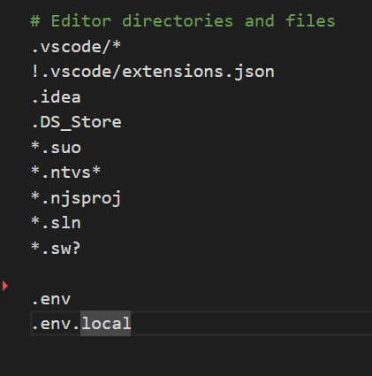
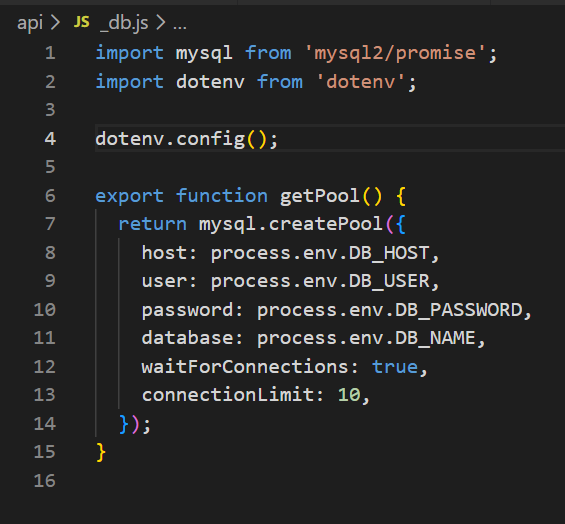
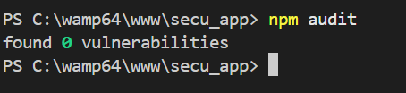
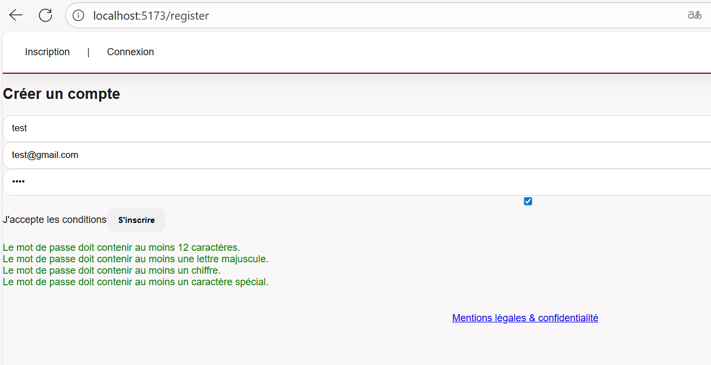
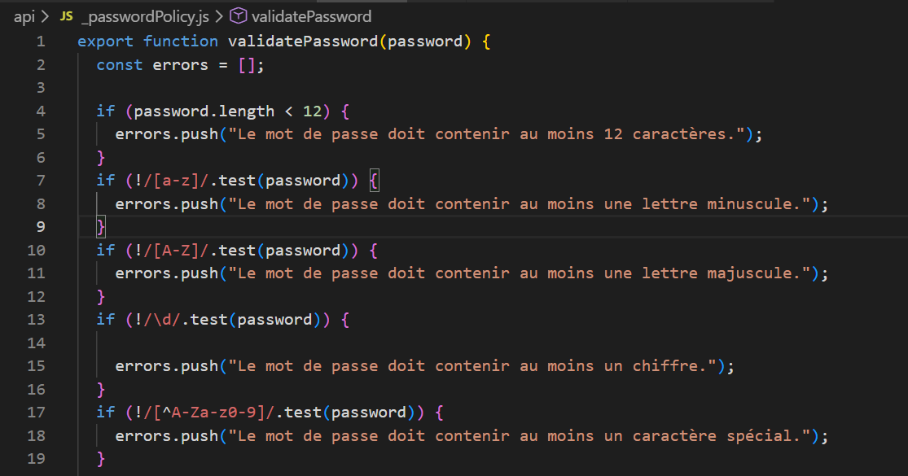
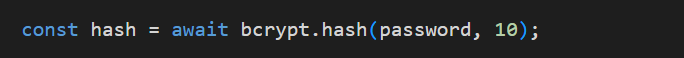
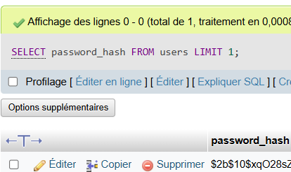
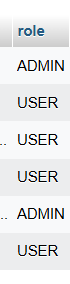
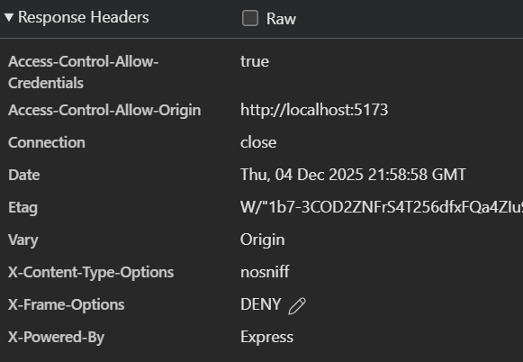

# Checklist d'Audit Sécurité - Projet Mots meles Marie-Grâce OKRY


## 1. Architecture & Configuration

### 1.1 Gestion des secrets

- [X] **Aucun secret en clair dans le code** : Les mots de passe, clés API, tokens n'apparaissent pas dans les fichiers source (*.js, *.php, *.py, etc.)
  - Vérification : `git log` et `git diff` ne doivent pas contenir de secrets
  - Les secrets doivent être dans un fichier `.env` (ajouté au `.gitignore`)

- [X] **Fichier `.gitignore` configuré** : Les fichiers `.env`, `config/`, `secrets/` ne sont pas dans le dépôt Git

- [X] **Variables d'environnement utilisées** : Accès aux secrets via `process.env` (Node), `$_ENV` (PHP), ou équivalent

**Preuves attendues :**
- Capture d'écran du `.gitignore`

- Extrait du code montrant l'utilisation de variables d'env


---

--- L'application n'ayant pas éta*é déployé 1.2 et 1.3 ne peuvent pas être répondu

### 1.4 Dépendances saines

- [X] **Audit des paquets exécuté sans vulnérabilités critiques**
  - Node.js : `npm audit` (résultat : 0 vulnérabilités "High" ou "Critical")
  - PHP : `composer audit` (résultat : 0 vulnérabilités critiques)
  - Python : `pip check` ou `safety check`

- [X] **Les dépendances sont à jour** : Pas de version obsolète connue pour être vulnérable

**Preuves attendues :**

- Capture d'écran du résultat `npm audit` / `composer audit`



- Fichier `package.json` ou `composer.lock` montrant les versions

---

## 2. Authentification & Sessions

*Objectif : Vérifier que personne ne peut usurper une identité.*

### 2.1 Mots de passe robustes

- [X] **Validation au signup** : La création de compte impose un minimum de 12 caractères

- [X] **Complexité requise** (au moins 3 critères) :
  - [X] Majuscules
  - [X] Minuscules
  - [X] Chiffres
  - [X] Caractères spéciaux

- [X] **Message d'erreur clair** : L'utilisateur sait pourquoi son mot de passe est rejeté

**Preuves attendues :**
- Capture d'écran du formulaire d'inscription avec message de validation



- Code source montrant la validation côté serveur


---

### 2.2 Stockage des mots de passe

- [X] **Algorithme moderne obligatoire** : `bcrypt`, `Argon2`, ou `PBKDF2`
  - **Interdiction absolue** : MD5, SHA1, SHA256 simple (sans salt), ou texte clair
  
- [X] **Salt généré automatiquement** : Chaque mot de passe a son propre salt unique

- [X] **Coût computationnel approprié** : Bcrypt avec au moins 10 rounds (par défaut)

**Preuves attendues :**
- Code source montrant `bcrypt.hash()`, `password_hash()`, ou `Argon2` utilisé

- Requête SQL montrant la colonne password : `$2a$...` (bcrypt), `$argon2...` (Argon2)

- Résultat de `SELECT password FROM users LIMIT 1` doit montrer un hash, pas du texte brut


---

### 2.3 Cookies & Sessions

- [X] **Cookie de session avec HttpOnly** : `Set-Cookie: sessionId=...; HttpOnly; Secure; SameSite=Strict`

- [X] **Attribut Secure activé** : Le cookie ne se transmet qu'en HTTPS

- [X] **SameSite configuré** : `SameSite=Strict` ou `Lax` (protège contre CSRF)

- [X] **Expiration de session** : Timeout après 15-30 minutes d'inactivité

- [X] **Logout détruit la session** : Le bouton "Se déconnecter" supprime vraiment la session côté serveur

---

## 3. Contrôle d'Accès 

*Objectif : Appliquer le principe de "Moindre Privilège".*

### 3.1 Rôles distincts

- [X] **Au minimum 2 rôles implémentés** : Exemple : `USER` et `ADMIN`
  - Ou : `MANAGER`, `EMPLOYEE`, `VIEWER`
  - Ou : `AUTHOR`, `EDITOR`, `READER`

- [X] **Base de données** : Colonne `role` ou `roles` dans la table `users`

**Preuves attendues :**
- Schéma de base de données montrant la table users avec la colonne role
- Capture d'écran montrant 2 comptes avec rôles différents


---

### 3.2 Vérification d'accès sur chaque route

- [X] **Pas d'accès direct à une URL admin sans permission**
  - Tentative : `/admin` sans être Admin → Rejet (403 Forbidden ou redirect)
  - Tentative : `/admin/delete-user/5` en tant qu'User → Rejet

- [X] **Vérification côté serveur** (pas seulement front-end)
  - Le serveur valide les permissions avant de répondre

**Preuves attendues :**

Voir readme

---

### 3.3 Pas de modification de données d'un autre utilisateur 

- [X] **L'utilisateur A ne peut pas voir/modifier les données de l'utilisateur B**
  - Tentative : `/profil/user/15` → Rejet si vous n'êtes pas l'user 15
  - Tentative : `/mon-compte/editer` → Impossible d'éditer le compte d'un autre

- [ ] **Vérification : `if (userId != loggedInUser) { deny(); }`**

**Preuves attendues :**

Voir readme

---

## 4. Injections & Données 

*Objectif : Bloquer les attaques SQLi et XSS (OWASP Top 10).*

### 4.1 Injection SQL - Requêtes préparées

- [X] **Aucune requête SQL concaténée** : Interdiction de faire `"SELECT * FROM users WHERE id=" + userId`

- [X] **Requêtes préparées utilisées systématiquement**
  - Node + MySQL : `connection.query("SELECT * FROM users WHERE id = ?", [userId])`
  - PHP + PDO : `$stmt = $pdo->prepare("SELECT * FROM users WHERE id = ?"); $stmt->execute([$userId]);`
  - Python + SQLite : `cursor.execute("SELECT * FROM users WHERE id = ?", (userId,))`

- [X] **ORM accepté comme alternative** : Doctrine, Eloquent, SQLAlchemy, Mongoose, etc.

**Preuves attendues :**
Voir Readme

---

### 4.2 Anti-XSS - Affichage sécurisé

- [X] **Toutes les données affichées sont échappées/encodées**
  - Framework auto : Twig `{{ variable }}` (auto-échappe), Blade, JSX
  - Manual : `htmlspecialchars($variable)`, `DOMPurify.sanitize()`, etc.

- [X] **Test XSS** : Un utilisateur peut poster du texte (commentaire, bio, profil)
  - Tentative : Poster `<script>alert('XSS')</script>` dans un commentaire
  - Résultat attendu : Le script ne s'exécute PAS, on voit du texte brut ou échappé

**Preuves attendues :**
Voir Readme

---

### 4.3 Validation des entrées

- [X] **Tous les champs de formulaire validés côté serveur** (pas juste front-end)
  - Email : Format `name@domain.com`
  - Numéro : Uniquement des chiffres
  - Texte : Longueur min/max, caractères autorisés

- [X] **Rejet des données invalides** : Erreur lisible ou silencieux selon le contexte

---

## 5. Fonctionnalités Sensibles 

*Objectif : Sécuriser les actions critiques.*

### 5.1 Protection CSRF

- [X] **Un token CSRF unique par formulaire** (si architecture MVC classique)
  - Formulaire contient : `<input type="hidden" name="csrf_token" value="abc123xyz">`
  - Token validé côté serveur avant de traiter POST/PUT/DELETE

- [X] **Token généré à chaque page** (ou au moins unique par session)

- [X] **Validation stricte** : Un token invalide = rejet de la requête


---

### 5.2 Uploads de fichiers

- [ ] **Extension vérifiée (Liste blanche)** : Seuls `.jpg`, `.png`, `.pdf` acceptés (pas `.exe`, `.php`)

- [ ] **Type MIME vérifié côté serveur** : `mime_content_type()`, `finfo_file()`, ou libraire `file-type`

- [ ] **Fichier renommé avec UUID** : `avatar_12345678-1234.jpg` au lieu de `mon-avatar.jpg`
  - Empêche l'écrasement accidentel et l'exécution de scripts

- [ ] **Stockage en dehors du web root** : Le fichier uploadé ne doit pas être accessible directement par URL

**Preuves attendues :**
- Code source montrant la validation d'extension et MIME
- Tentative d'upload d'un `.exe` ou `.php` → Rejet
- Capture écran montrant le fichier renommé en UUID

---

## 6. Conformité & RGPD 

*Objectif : Respecter la loi et l'utilisateur.*

### 6.1 Minimisation des données

- [X] **Formulaire d'inscription minimal** : Seulement Email, Mot de passe, Nom (et rien de plus sans justification)
  - **Interdiction** : Date de naissance, Numéro de Sécu, Adresse complète (sauf si nécessaire pour livraison)

- [X] **Justification documentée** : Pourquoi chaque champ est collecté

**Preuves attendues :**
Voir Readme

---

### 6.2 Consentement explicite

- [X] **Case à cocher pour consentement** (NON pré-cochée)
  - `<input type="checkbox" name="consent" required>` (pas de `checked`)

- [X] **Texte clair du consentement** : "J'accepte que mes données soient utilisées pour [usage précis]"

- [X] **Impossible d'envoyer le formulaire sans cocher** : Validation HTML `required` + serveur

**Preuves attendues :**
Voir Readme

---

### 6.3 Mentions légales & Politique de confidentialité

- [X] **Page de conformité accessible** : Lien visible dans le footer (`/legal`, `/privacy`, etc.)

- [X] **Contenu minimal**
  - Qui gère le site (nom, adresse)
  - Quelles données sont collectées
  - À quoi elles servent
  - Durée de conservation
  - Droits des utilisateurs (accès, modification, suppression, portabilité)

- [X] **Lien dans le footer** : Visible sur toutes les pages

**Preuves attendues :**
Voir Readme

---

## 7. En-têtes de Sécurité HTTP 

*Objectif : Durcir le navigateur via les headers.*

### 7.1 Headers de sécurité basiques

- [X] **X-Content-Type-Options: nosniff**
  - Empêche le navigateur de deviner le type MIME

- [X] **X-Frame-Options: DENY** (ou SAMEORIGIN)
  - Empêche l'affichage du site dans une iframe (Clickjacking)

- [ ] **Content-Security-Policy** (Bonus, si possible)
  - Limite les sources de ressources (scripts, stylesheets)

**Preuves attendues :**



---

### 7.2 Sécurité des cookies (redondance avec section 2.3)

- [X] **Secure flag** : `Set-Cookie: ... Secure`
- [X] **HttpOnly flag** : `Set-Cookie: ... HttpOnly`
- [X] **SameSite flag** : `Set-Cookie: ... SameSite=Strict`

---

## 9. Tests de Sécurité 

*Objectif : Vérifier la solidité globale.*

### 9.1 Audit automatique

- [X] **Scan de dépendances exécuté** : `npm audit`, `composer audit`, ou `snyk`

- [X] **Scan SAST (Static Analysis)** (Optionnel)
  - ESLint security plugin, SonarQube, Semgrep

- [X] **Pas de vulnérabilités critiques restantes**

**Preuves attendues :**
Voir readme
---

### 9.2 Test de pénétration basique (Optionnel)

- [X] **Tentative d'exploitation des 3 failles principales testées**
  - SQL Injection
  - XSS
  - Accès non autorisé (IDOR)

- [ ] **Rapport documenté** : Vulnérabilité, localisation, exploitation, correction

---

## 10. Documentation & Code (General)

*Objectif : Trace et maintenabilité.*

### 10.1 README & Documentation

- [X] **README.md présent** avec :
  - Description du projet
  - Installation locale
  - Variables d'environnement à configurer (`.env.example`)
  - Commandes de déploiement

- [X] **Code commenté** sur les parties sensibles (authentification, validation)

- [X] **Diagramme d'architecture** (optionnel mais apprécié)

**Preuves attendues :**
- Fichier `README.md` dans le repo
- Fichier `.env.example` listant les variables

---

### 10.2 Contrôle de version

- [X] **Dépôt Git** avec commits clairs
  - Pas de commit "gros commit" sans message
  - Historique lisible

- [ ] **Branch main protégée** (optionnel) : Pas de push direct, review avant merge


---

## Décision Finale

### VALIDÉ (Au moins 90% des cases cochées)
Le projet respecte les standards de sécurité minimaux.

### À RÉVISER (70-89%)
Correction requise avant validation. Liste des points critiques :
- [ ] ...
- [ ] ...

### REFUSÉ (< 70% ou failles critiques)
Le projet présente des vulnérabilités graves. Révision complète nécessaire.

---

## Notes d'Audit

**Observations générales :**

```
[Espace pour commentaires détaillés]
```

**Points forts :**

```
[Ce qui fonctionne bien]
```

**Failles à corriger en priorité :**

1. ...
2. ...
3. ...

**Recommendation pour la suite :**

```
[Conseils pour aller plus loin]
```

---
