# Projet Mots Mêlés Sécurisés

Application web de jeux de mots mêlés avec gestion d'utilisateurs, système de scores et tableau de classement. Développée avec React (frontend) et Node.js/Express (backend), avec une base de données MySQL.

---

## Table des matières

1. [Aperçu du projet](#aperçu-du-projet)
2. [Fonctionnalités](#fonctionnalités)
3. [Architecture technique](#architecture-technique)
4. [Prérequis](#prérequis)
5. [Installation](#installation)
6. [Configuration](#configuration)
7. [Lancement du projet](#lancement-du-projet)
8. [Structure du projet](#structure-du-projet)
9. [Utilisation de l'application](#utilisation-de-lapplication)
10. [Tests](#tests)
11. [Sécurité](#sécurité)
12. [API Endpoints](#api-endpoints)  
13. [Preuves](#preuves)

---

## Aperçu du projet

Cette application permet de :

* Créer et gérer des grilles de mots mêlés
* Jouer aux mots mêlés avec un système de sélection interactif
* Suivre les scores et consulter les classements
* Gérer des comptes utilisateurs (USER et ADMIN)

Le projet met l'accent sur la **sécurité** : authentification JWT, validation des données, politique de mots de passe robuste, headers de sécurité, conformité RGPD.

---

## Fonctionnalités

### Pour les utilisateurs (USER)

* Inscription avec validation stricte du mot de passe
* Connexion sécurisée avec JWT
* Consultation des grilles disponibles
* Jeu interactif (sélection de mots dans toutes les directions)
* Système de scoring basé sur le temps
* Consultation du classement par grille

### Pour les administrateurs (ADMIN)

* Toutes les fonctionnalités USER
* Création de grilles avec génération automatique
* Modification et suppression de grilles
* Visualisation de toutes les grilles

### Sécurité

* Authentification JWT avec cookies HttpOnly
* Politique de mot de passe : 12 caractères minimum, majuscules, minuscules, chiffres, caractères spéciaux
* Headers de sécurité (X-Content-Type-Options, X-Frame-Options)
* Validation des entrées utilisateur
* Protection contre les injections SQL (requêtes préparées)
* Consentement RGPD obligatoire

---

## Architecture technique

### Frontend

* **React 19** avec React Router pour la navigation
* **Vite** comme bundler et serveur de développement
* **CSS moderne** avec thème bordeaux premium
* Gestion d'état locale avec hooks React

### Backend

* **Node.js** avec **Express 5**
* **MySQL 8** pour la base de données
* **JWT** pour l'authentification
* **bcrypt** pour le hashing des mots de passe
* Architecture modulaire avec handlers séparés

### Base de données

4 tables principales :

* `users` : comptes utilisateurs
* `grids` : métadonnées des grilles
* `grid_cells` : contenu des cellules
* `grid_words` : mots à trouver
* `scores` : historique des scores

---

## Prérequis

Avant de commencer, assurez-vous d'avoir installé :

* **Node.js** version 20 ou supérieure
* **npm** ou **yarn**
* **MySQL** version 8 ou supérieure (ou MariaDB)
* Un éditeur de code (VS Code recommandé)
* Git (pour cloner le projet)

---

## Installation

### 1. Cloner le projet

```bash
git clone <URL_DU_REPO>
cd secu_app
```

### 2. Installer les dépendances

```bash
npm install
```

Cette commande installe toutes les dépendances listées dans `package.json`, notamment :

* React et React Router
* Express et middleware associés
* MySQL2 pour la connexion à la base de données
* bcrypt et jsonwebtoken pour la sécurité
* Vite pour le développement frontend

---

## Configuration

### 1. Configurer la base de données

#### a) Créer la base de données MySQL

Connectez-vous à MySQL :

```bash
mysql -u root -p
```

Créez la base de données et l'utilisateur :

```sql
CREATE DATABASE mots_meles CHARACTER SET utf8mb4 COLLATE utf8mb4_unicode_ci;
CREATE USER 'secu_user'@'localhost' IDENTIFIED BY 'VOTRE_MOT_DE_PASSE_SECURISE';
GRANT ALL PRIVILEGES ON mots_meles.* TO 'secu_user'@'localhost';
FLUSH PRIVILEGES;
EXIT;
```

#### b) Importer le schéma de base de données

Le fichier `mots_meles.sql` contient la structure complète de la base avec des données de démonstration.

```bash
mysql -u secu_user -p mots_meles < "mots_meles .sql"
```

**Note** : Le fichier contient :

* La structure des 5 tables
* Des grilles d'exemple
* Des utilisateurs de test (voir ci-dessous)

### 2. Configurer les variables d'environnement

Créez un fichier `.env` à la racine du projet :

```bash
cp .env.example .env
```

Éditez le fichier `.env` avec vos informations :

```env
DB_HOST=localhost
DB_USER=secu_user
DB_PASSWORD=VOTRE_MOT_DE_PASSE_SECURISE
DB_NAME=mots_meles

JWT_SECRET=votre_secret_jwt_tres_long_et_complexe_ici_123456789
```


---

## Lancement du projet

Le projet nécessite de lancer deux serveurs simultanément :

### Option 1 : Deux terminaux séparés

**Backend** :

```bash
npm run dev:api
```

**Frontend** :

```bash
npm run dev
```

### Option 2 : Avec concurrently

```bash
npm install -g concurrently
```

Ajoutez dans `package.json` :

```json
"dev:all": "concurrently \"npm run dev:api\" \"npm run dev\""
```

Lancez :

```bash
npm run dev:all
```

---

## Structure du projet
```
secu_app/
├── api/                          # Backend Express
│   ├── _auth.js                  # Middleware d'authentification JWT
│   ├── _db.js                    # Configuration pool MySQL
│   ├── _passwordPolicy.js        # Validation des mots de passe
│   ├── _securityHeaders.js       # Headers de sécurité
│   ├── login.js                  # Handler connexion
│   ├── register.js               # Handler inscription
│   ├── logout.js                 # Handler déconnexion
│   ├── grids/
│   │   ├── create.js             # Créer une grille (admin)
│   │   ├── list.js               # Lister toutes les grilles (admin)
│   │   ├── public-list.js        # Grilles publiques (users)
│   │   ├── view/[id].js          # Voir une grille
│   │   ├── update/id.js          # Modifier une grille (admin)
│   │   └── delete/id.js          # Supprimer une grille (admin)
│   └── scores/
│       ├── index.js              # Enregistrer un score
│       └── leaderboard/[grid_id].js  # Classement par grille
│
├── src/                          # Frontend React
│   ├── components/               # Composants réutilisables
│   │   ├── AdminRoute.jsx        # Guard pour routes admin
│   │   ├── UserRoute.jsx         # Guard pour routes user
│   │   └── GuestRoute.jsx        # Guard pour pages publiques
│   │
│   ├── pages/                    # Pages de l'application
│   │   ├── register.jsx          # Page d'inscription
│   │   ├── Login.jsx             # Page de connexion
│   │   ├── UserDashboard.jsx     # Dashboard utilisateur
│   │   ├── AdminDashboard.jsx    # Dashboard admin
│   │   ├── UserGrids.jsx         # Liste des grilles (user)
│   │   ├── PlayGrid.jsx          # Interface de jeu
│   │   ├── Leaderboard.jsx       # Classement
│   │   ├── ListGrids.jsx         # Liste des grilles (admin)
│   │   ├── CreateGrid.jsx        # Créer une grille
│   │   ├── EditGrid.jsx          # Modifier une grille
│   │   ├── ViewGrid.jsx          # Visualiser une grille
│   │   └── Legal.jsx             # Mentions légales/RGPD
│   │
│   ├── utils/
│   │   └── generateGrid.js       # Algorithme de génération de grilles
│   │
│   ├── App.jsx                   # Composant racine + routing
│   ├── main.jsx                  # Point d'entrée React
│   └── index.css                 # Styles globaux (thème bordeaux)
│
├── tests/                        # Tests unitaires (Vitest)
│   ├── auth.test.js
│   ├── login.test.js
│   ├── register.test.js
│   ├── passwordPolicy.test.js
│   ├── securityHeaders.test.js
│   └── scoresLeaderboard.test.js
│
├── server.mjs                    # Serveur Express principal
├── vite.config.js                # Configuration Vite + proxy
├── package.json                  # Dépendances et scripts
├── .env.example                  # Template des variables d'environnement
├── .gitignore                    # Fichiers ignorés par Git
└── mots_meles (1).sql           # Schéma de base de données
````
---

## Utilisation de l'application

### 1. Inscription
- Accédez à : **http://localhost:5173/register**
- Remplissez le formulaire  
  *(Mot de passe : minimum 12 caractères, majuscules, minuscules, chiffres, caractères spéciaux)*  
- Cliquez sur **"S'inscrire"**

---

### 2. Connexion
- Accédez à : **http://localhost:5173/login**
- Redirection automatique selon le rôle :
  - **USER** 
  - **ADMIN**

---

### 3. Jouer (USER)
- Cliquez sur **"Grilles"**
- Choisissez une grille et cliquez sur **"Jouer"**
- **Gameplay :**
  - Sélectionnez les mots (horizontal, vertical, diagonal)
- **Fin de partie :**
  - Score = `1000 - temps_en_secondes`

---

### 4. Administrer (ADMIN)
- **Créer une grille :** `/admin/grids/create`  
  *(Titre, Taille, Mots séparés par virgules)*
- **Gérer les grilles :** `/admin/grids`  
  *(Voir, Éditer, Supprimer)*


---

## Tests

Le projet utilise **Vitest** pour les tests unitaires.

## Lancer tous les tests
```bash
npm test
```

## Lancer les tests en mode watch
```bash
npm run test:watch
```
## Tests disponibles
- **auth.test.js** : Vérification des middlewares JWT
- **login.test.js** : Scénarios de connexion
- **register.test.js** : Validation de l'inscription
- **passwordPolicy.test.js** : Politique de mot de passe
- **securityHeaders.test.js** : Headers de sécurité
- **scoresLeaderboard.test.js** : Logique de classement

## Couverture de code
```bash
npm run test:coverage
```
---
## Sécurité

### Mesures implémentées

- **Authentification** :  
  JWT stocké dans un cookie **HttpOnly**, **Secure**, **SameSite=Strict**, valable **30 minutes**.

- **Mots de passe** :  
  Hashing avec **bcrypt** (coût 10) + politique de complexité renforcée.

- **Base de données** :  
  Utilisation de **requêtes préparées** pour éviter les injections SQL.

- **Headers HTTP** :  
  - `X-Content-Type-Options: nosniff`  
  - `X-Frame-Options: DENY`

- **RGPD** :  
  Consentement explicite et collecte minimale des données.

---

## API Endpoints

---

### Authentification

| Méthode | Route          | Auth | Description  |
|--------|----------------|------|--------------|
| POST   | /api/register  | ❌   | Inscription  |
| POST   | /api/login     | ❌   | Connexion    |
| POST   | /api/logout    | ✅   | Déconnexion  |

---

### Grilles

| Méthode | Route                     | Auth | Rôle        | Description                   |
|--------|----------------------------|------|-------------|-------------------------------|
| GET    | /api/grids/public-list     | ✅   | USER/ADMIN  | Liste des grilles disponibles |
| GET    | /api/grids/list            | ✅   | ADMIN       | Liste complète (admin)        |
| POST   | /api/grids/create          | ✅   | ADMIN       | Créer une grille              |
| GET    | /api/grids/view/:id        | ✅   | USER/ADMIN  | Voir une grille               |
| PUT    | /api/grids/update/:id      | ✅   | ADMIN       | Modifier une grille           |
| DELETE | /api/grids/delete/:id      | ✅   | ADMIN       | Supprimer une grille          |

---

### Scores

| Méthode | Route                               | Auth | Description               |
|--------|--------------------------------------|------|---------------------------|
| POST   | /api/scores                           | ✅   | Enregistrer un score      |
| GET    | /api/scores/leaderboard/:grid_id      | ❌   | Classement d'une grille   |

---

### Formats de réponse

#### Succès
```json
{
  "message": "Action réussie",
  "data": { }
}
```
#### Erreur
```json
{
  "message": "Description de l'erreur",
  "errors": ["détail 1", "détail 2"]
}
```

## Preuves  

### Système d'Authentification

Voici donc les preuves de validations du système d'authentification:

- Capture écran du formulaire d'inscription:

- Tentative inscription avec mot de passe faible → Rejet (avec message):

- Capture écran du formulaire de connexion:

- Capture écran du cookie dans l'inspecteur réseau (HttpOnly, Secure, SameSite visibles):
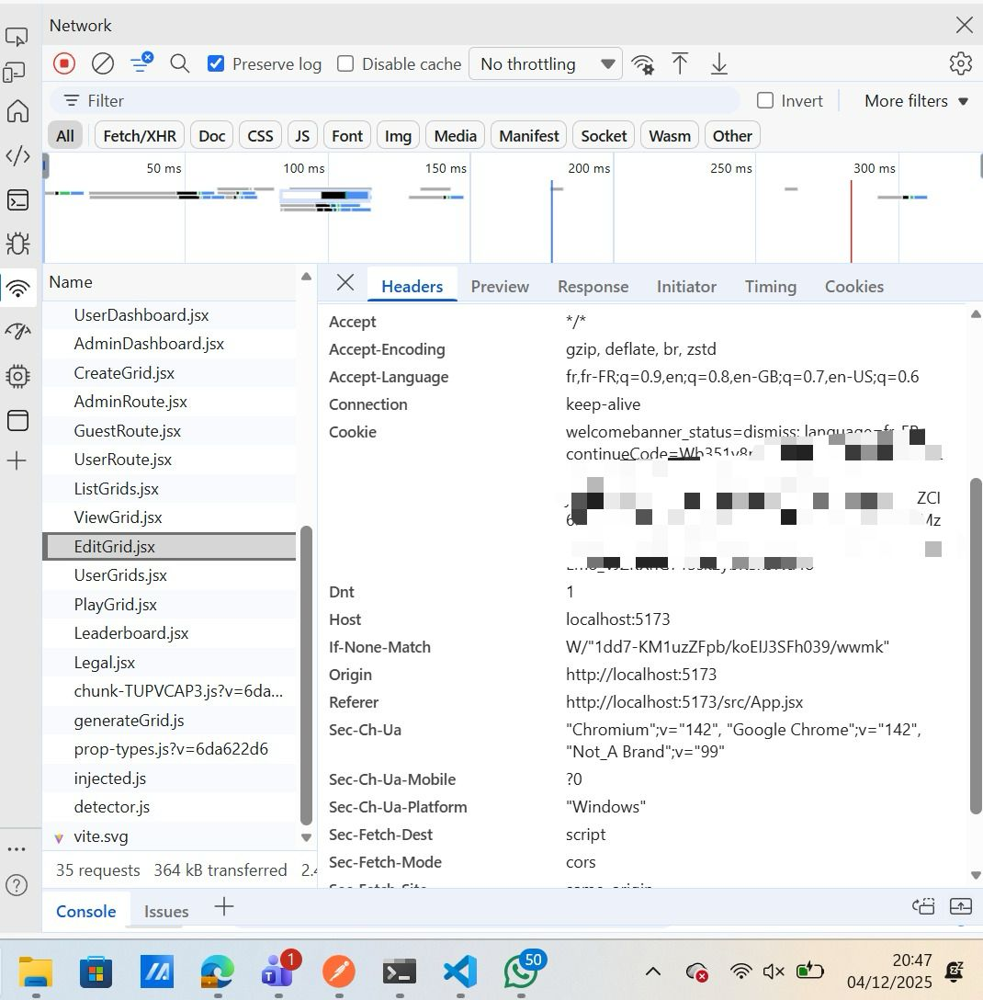

### Système de Rôles & Contrôle d'Accès

- Capture écran login avec 2 comptes (1 Admin, 1 User)
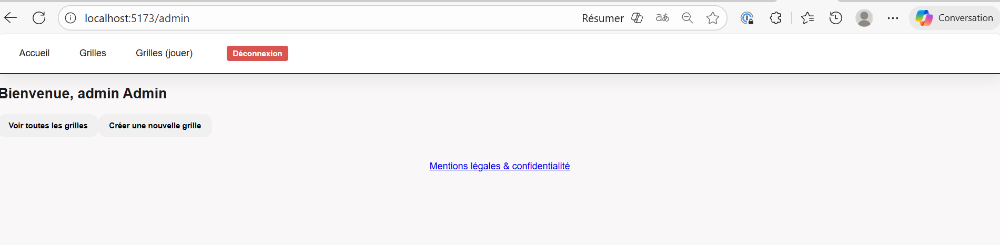
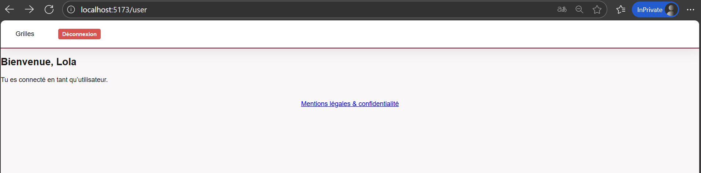
- Capture écran de la page Admin accessible pour Admin
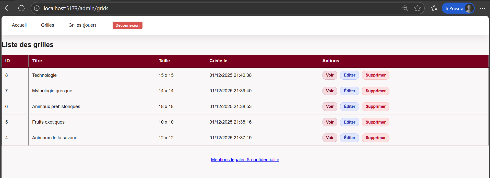
La page uniquement accessible pour l'Admin est par exemple la page de liste des grilles où l'admin peut voir, éditer, supprimer une grille
- Capture écran du rejet quand on essaie d'accéder /admin en tant qu'User
Lorsqu'on essaie d'accéder à /admin l'utilisateur n'ayant pas le droit sera toujours bloqué sur sa page

### Protections Contre Injections (SQL & XSS)

- Code source montrant les requêtes préparées (avec ? ou ORM syntax)
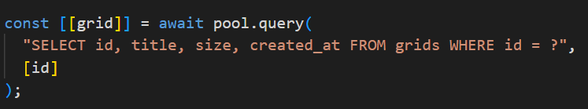
- Capture écran montrant un commentaire avec script affiché comme texte
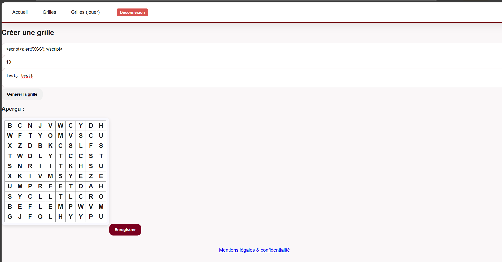
- Tentative d'injection SQL simple → Rejet ou pas de résultat anormal
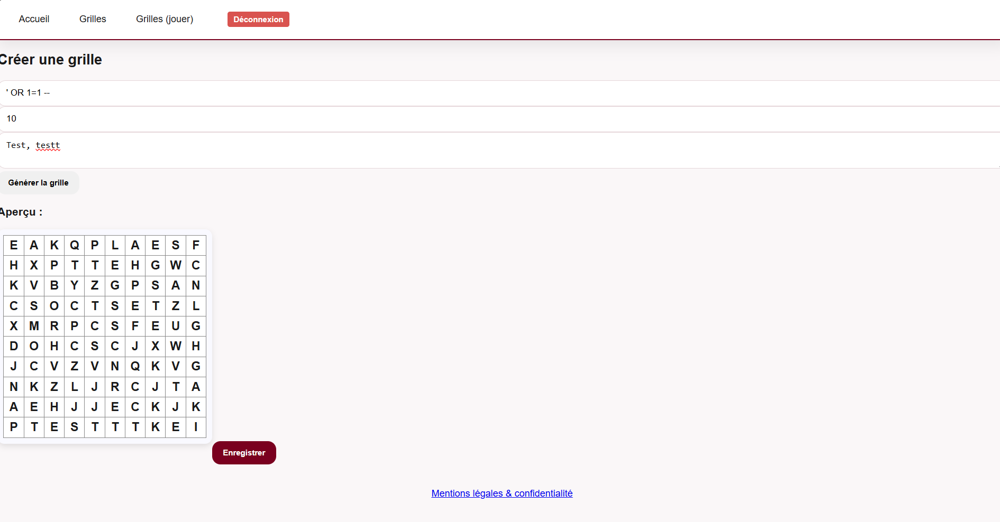

### Conformité RGPD & Protection des Données

- Capture écran du formulaire d'inscription (champs visibles)

- Capture écran montrant la case à cocher décochée
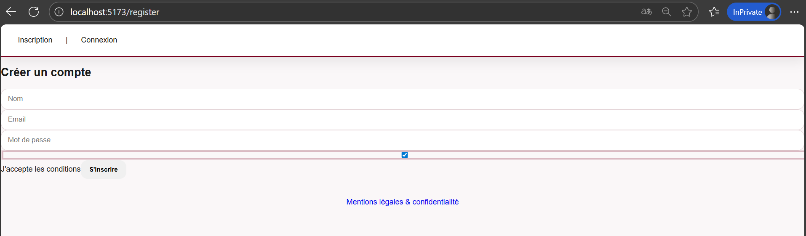
- Capture écran du lien "Mentions Légales" dans le footer
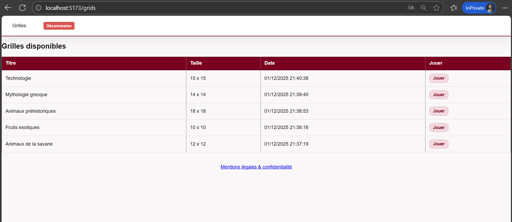
- Contenu de la page `/legal` ou `/privacy`
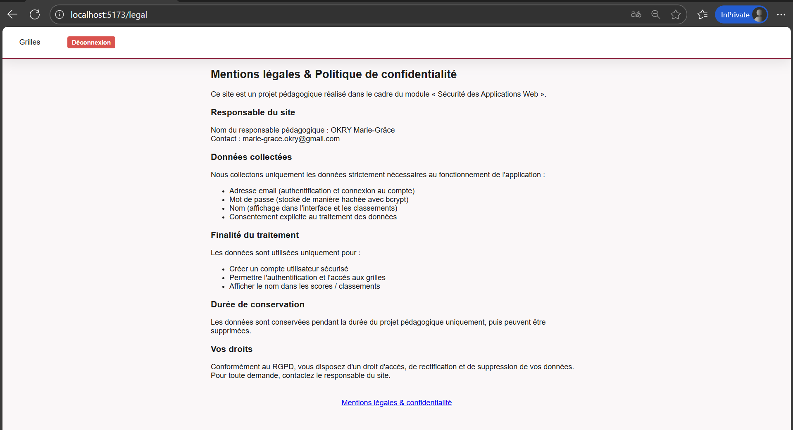

### Protection CSRF

- Code source montrant la génération/validation du token CSRF (ou JWT)
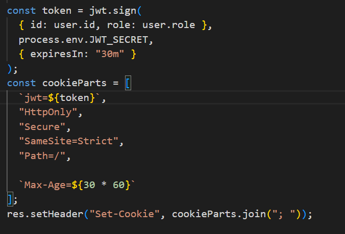
- Capture écran de l'inspecteur montrant le token dans le formulaire
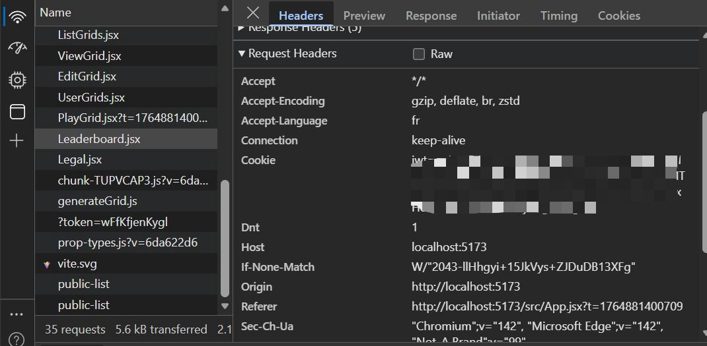

### Headers de Sécurité HTTP

- Inspecteur réseau (Onglet Network) montrant les headers

- Capture écran de l'URL en HTTPS (pas HTTP)

Mon application n’est pas déployée, donc aucune URL HTTPS n’est disponible.
En mode localhost, le HTTPS n’est pas applicable.
Si nécessaire, un déploiement peut être effectué sur Render/Netlify/Vercel.

- Commande : `curl -I https://votre-app.com | grep -i "X-Content\|X-Frame"`

Inapplicable sans HTTPS / domaine

### Tests de Sécurité & Audits

- Capture écran du résultat `npm audit`


- Checklist d'Audit remplie à 90%+
[Voir le fichier](Checklist-Audit-Securite.md)


